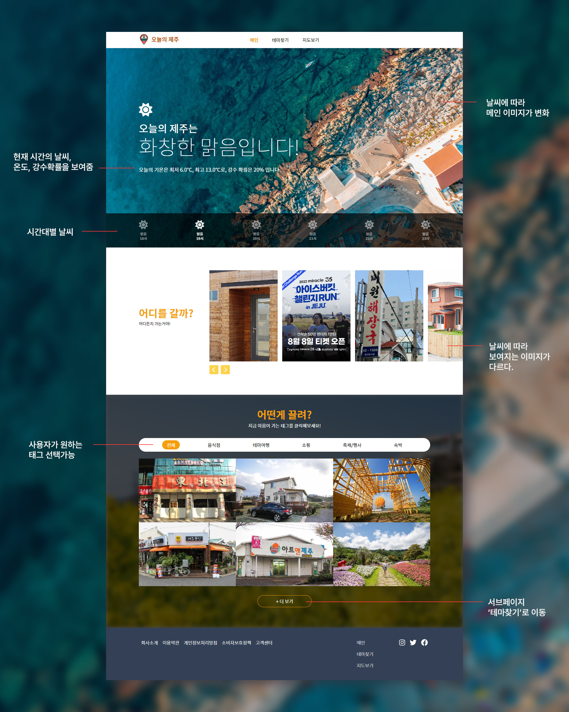
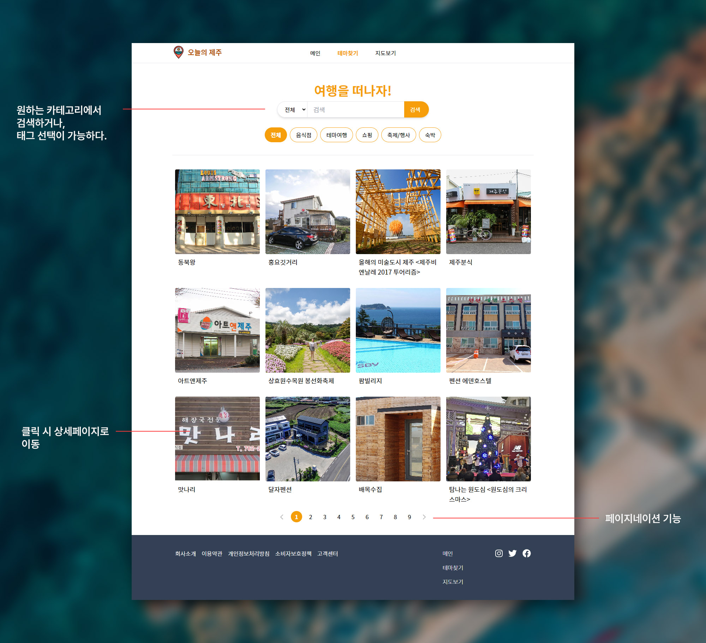
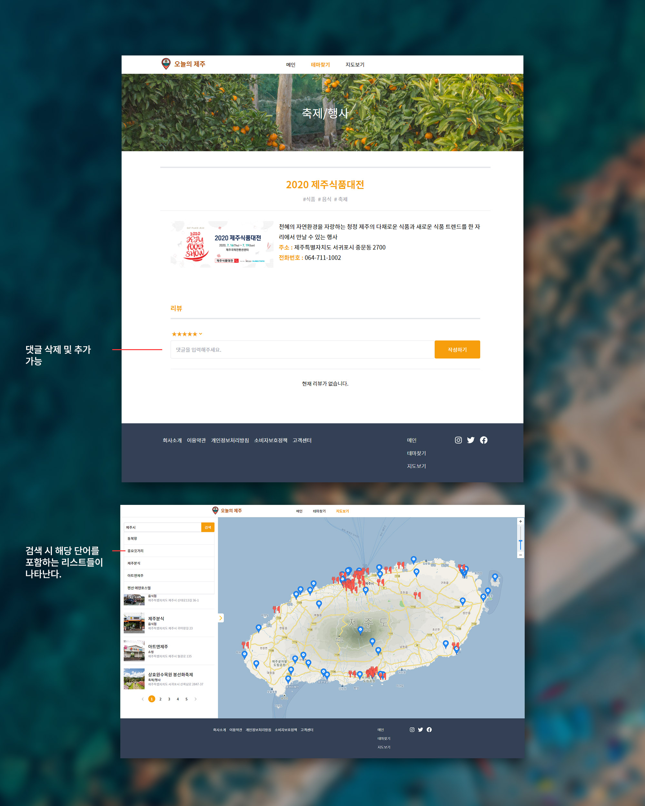

<h1>제주관광 사이트, 오늘의 제주</h1>

사이트 주소 : https://todays-jeju.netlify.app/

제작 과정 : https://beren-105.tistory.com/18

<h3>개발동기</h3>
"제주도에 여행왔는데 오늘은 어디를 갈까?"
'오늘의 제주'는 사용자가 제주도의 날씨를 확인하고 원하는 관광지를 찾을 수 있는 플랫폼입니다.

메인비주얼에 그 날의 날씨가 이미지와 함께 나타납니다. 비가 오면 비 오는 풍경이, 맑으면 맑은 풍경이 나타납니다. 하단에 시간대별 날씨가 함께 있어 오늘 하루의 날씨를 한눈에 파악할 수 있습니다.
메인 첫번째 하단 비주얼에서는 비가 올 시 음식점, 숙박 등의 실내 이미지가 나타나고, 맑거나 흐린 날에는 모든 이미지를 나타냅니다.
그 외의 서브페이지에서는 테마여행, 숙박업소, 축제, 음식점 등 다양한 관광 시설에 대한 정보를 제공합니다.

<h3>기대효과</h3>
<ul>
    <li>데이터의 시각화를 통한 사용자의 편의성 증가</li>
    <li>여행을 계획하는데 필요한 정도를 단일 플랫폼으로 제공함으로 검색에 필요한 사용자의 시간 절감</li>
</ul>

<h3>사용툴</h3>
<ul>
    <li>React</li>
    <li>비짓제주 API</li>
    <li>기상청 날씨 API</li>
</ul>

라이브러리
<ul>
    <li>tailwind</li>
    <li>React Slick</li>
</ul>

